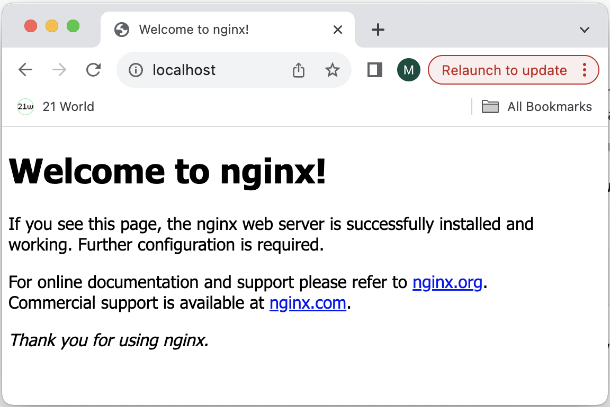
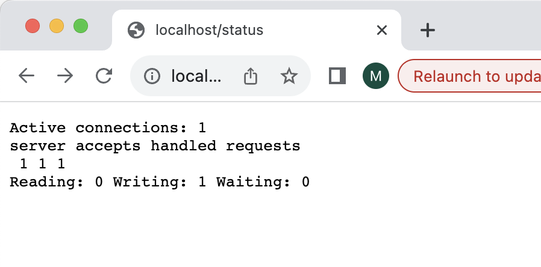

## Part 1. Ready-made docker
- Выкачиваем официальный докер-образ с nginx при помощи  `docker pull`
 
- Проверяем наличие докер-образа через `docker images`
 
- Запускаем докер-образ через `docker run -d [image_id|repository]`
 
- Проверяем, что образ запустился через `docker ps`
 
- Смотрим информацию о контейнере через `docker inspect [container_id|container_name]`
  
продолжение вывода `docker inspect`
  
продолжение вывода `docker inspect`
  
чтобы увидеть размер контейнера, выполним команду `docker inspect [container_id|container_name]` с флагом `-s` (то же самое, что `--size`)
 
- По выводу команды определяем:
    - размер контейнера: 1095 байт
    - список замапленных портов: нет
    - ip контейнера: 172.17.0.2
  Размер контейнера также можно узнать при помощи команды `docker ps` с флагом `-s` 
 
- Останавливаем докер образ через `docker stop [container_id|container_name]`
 
- Проверяем, что образ остановился через `docker ps`, и видим, что нет работающих контейнеров
 
- Запускаем докер с портами _80_ и _443_ в контейнере, замапленными на такие же порты на локальной машине, через команду `run`
 
- Проверяем, что в браузере по адресу _localhost:80_ доступна стартовая страница _nginx_
 
- Перезапускаем докер контейнер через `docker restart [container_id|container_name]` и проверяем при помощи команды `docker ps`, что контейнер запустился 
  

---

## Part 2. Operations with container
- Читаем конфигурационный файл _nginx.conf_ внутри докер контейнера через команду `exec`
 
- Создаём на локальной машине файл _nginx.conf_
 
- Настраиваем в нём по пути _/status_ отдачу страницы статуса сервера _nginx_
 
- Копируем созданный файл nginx.conf внутрь докер-образа через команду `docker cp`
 
- Перезапускаем _nginx_ внутри докер-образа через команду `exec`, предварительно проверив его
 
- Проверяем, что по адресу _localhost:80/status_ отдается страничка со статусом сервера _nginx_
 
- Экспортируем контейнер в файл _container.tar_ через команду `export`
 
- Останавливаем контейнер
 
- Удаляем образ через `docker rmi [image_id|repository]`, не удаляя перед этим контейнеры, для этого необходим флаг `-f`
 
- Удаляем остановленный контейнер
 
- Импортируем контейнер обратно через команду `import`, видим что до импорта у нас нет ни образов, ни работающих контейнеров, а после импорта появился образ
 
- Запускаем импортированный контейнер
 
- Проверяем, что по адресу _localhost:80/status_ отдается страничка со статусом сервера _nginx_.
 

---

## Part 3. Mini web server
- Напишем мини-сервер на _C_ и _FastCgi_, который будет возвращать простейшую страничку с надписью _Hello World!_ и сохраним его в файле _mini_server.c_
 
- Запускаем контейнер и обновляем в нём список доступного ПО, после чего мы можем установить в контейнере _gcc_ и библиотеку _fcgi_ (для компиляции исходного кода нашего мини-сервера), а также _spawn-fcgi_ (для запуска нашего мини-сервера)
 
- Копируем файл _mini_server.c_ в контейнер, компилируем его и запускаем при помощи _spawn-fcgi_
 
- Пишем свой nginx.conf, который будет проксировать все запросы с _81_ порта на _127.0.0.1:8080_
 
- Копируем файл конфигурации _nginx_ в контейнер и перезагружаем _nginx_
 
- Проверяем, что в браузере по _localhost:81_ отдаётся написанная нами страничка
 
Переносим файл _nginx.conf_ по пути _./nginx/nginx.conf_ (это понадобится позже)
 

---

## Part 4. Your own docker
- Напишем свой докер-образ, воспользовавшись готовым образом с _nginx'ом_, как базовым, который:
1. собирает исходники нашего мини-сервера на _FastCgi_;
2. запускает его на _8080_ порту;
3. копирует внутрь образа написанный _./nginx/nginx.conf_;
4. запускает _nginx_.
 Dockerfile:
 
- Проверяем через `docker images`, что образов на данный момент в _docker'е_ нет. Собираем написанный докер-образ через `docker build`, при этом указав имя и тег. Проверяем через `docker images`, что всё собралось корректно - образ появился. Запускаем собранный докер-образ с маппингом _81_ порта на _80_ на локальной машине и маппингом папки _./nginx_ внутрь контейнера по адресу, где лежат конфигурационные файлы _nginx'а_
 
- Проверяем, что по _localhost:80_ доступна страничка написанного мини-сервера
 
- Дописываем в _./nginx/nginx.conf_ проксирование странички _/status_, по которой надо отдавать статус сервера _nginx_, сохраняем файл
 
- Перезапускаем контейнер
 
- Конфигурационный файл внутри докер-образа обновился самостоятельно, без лишних действий. Убеждаемся в этом, проверив, что теперь по _localhost:80/status_ отдается страничка со статусом _nginx_
 

---

## Part 5. Dockle
- Просканируем наш образ через `dockle [image_id|repository]`
 
- Исправим _Dockerfile_
 
- После пересборки образа при проверке через _dockle_ нет ошибок и предупреждений
 

---

## Part 6. Basic Docker Compose
- Напишем файл _docker-compose.yml_, с помощью которого:
1. Поднимем докер-контейнер из нашего Dockerfile (он будет работать в локальной сети, т.к. не использованы инструкции EXPOSE и маппинг портов на локальную машину).
2. Поднимем докер-контейнер с _nginx_.
 8080 порт второго контейнера замаплен на 80 порт локальной машины
 
- Проксирование всех запросов с _8080_ порта второго контейнера на _81_ порт первого контейнера настраивается в nginx.conf
 
- Проверяем, что все запущенные контейнеры остановлены. Собираем и запускаем проект с помощью команд `docker-compose build` и `docker-compose up`
 
- Проверяем, что в браузере по _localhost:80_ отдаётся наша страничка, как и ранее
 
